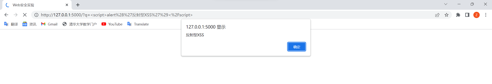
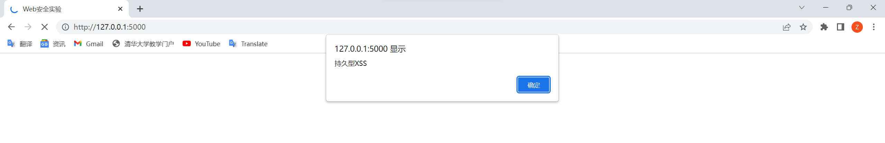
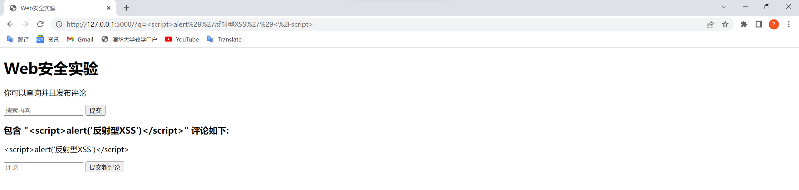
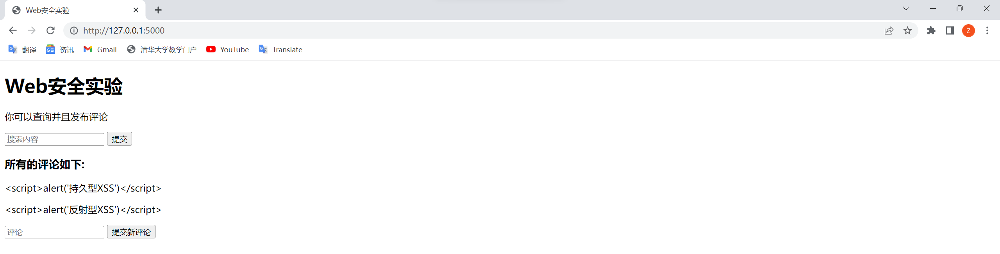
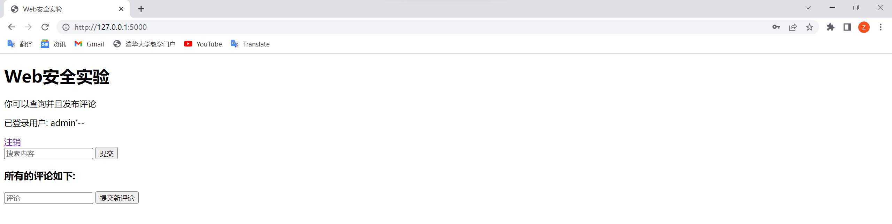
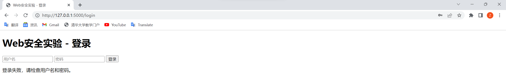
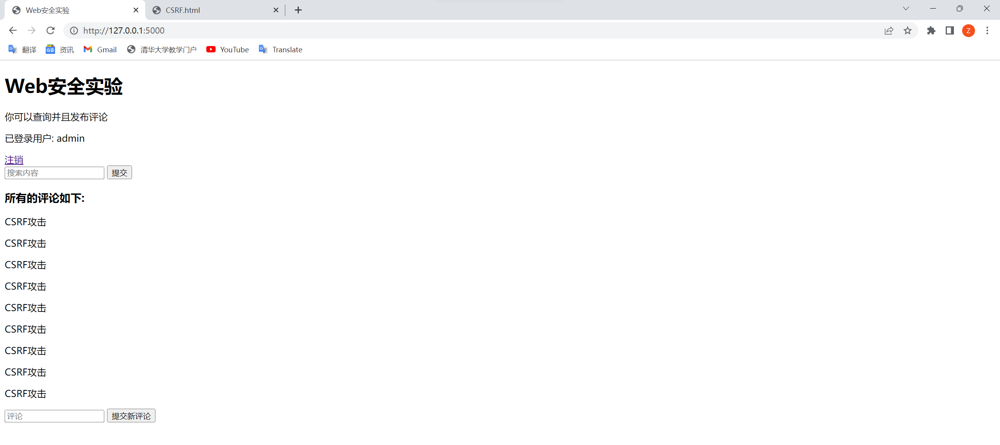
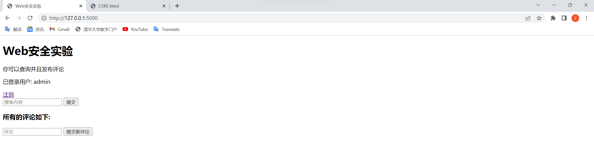

# 第13章 常见Web漏洞演示 实验报告 

万振南 2021030014

### 1.环境设置 

本实验的环境设置如下：

操作系统：Windows 11

编程语言：Python 3.11.1 html

相关库：Flask 2.3.2

### 2.关键步骤 

整个实验分为三个部分：XSS、SQL、CSRF

**XSS**

（1）安装 Flask 框架，在命令行中输入 'pip install flask'

（2）运行 Flask 服务器，打开网络学堂上的代码，进入目录 XSS，在命令行中输入 'python -m flask run'

（3）在浏览器中打开网站 http://127.0.0.1:5000/ ，显示 Web安全实验，有查询和提交评论两个输入框

（4）在查询和提交评论两个输入框中分别输入 `<script>alert('反射型XSS')</script>``<script>alert('持久型XSS')</script>` 观察实验结果。然后 Ctrl+C 退出

（5）修改代码防御 XSS 攻击，本实验采用转义字符的方法防御 XSS 攻击，用到了 escape 函数

（6）重复上面的步骤（2）-（4），观察实验结果是否变化

**SQL**

（1）添加一个登录功能，为此修改了 app.py index.html 并添加了 login.html

（2）运行 Flask 服务器，进入目录 SQL，在命令行中输入 'python -m flask run'

（3）在浏览器中打开网站 http://127.0.0.1:5000/ ，显示 “Web安全实验”，有登录按钮

（4）点击登录，输入预设的用户名（admin）和密码（password）登录，成功登录，登出

（5）再用用户名（admin'--）和任意密码（a）登录，观察能否登录

（6）修改代码防御 SQL 攻击，本实验采用参数化查询接口的方法防御 XSS 攻击，`query = "SELECT username, password FROM users WHERE username = ? AND password = ?"``result = db.cursor().execute(query, (username, password)).fetchone()`

（7）重复上面的步骤（2）-（5），观察实验结果是否变化

**CSRF**

（1）添加一个恶意网站 CSRF.html，每次访问这个网站，都会尝试向 http://127.0.0.1:5000/ 中添加评论 “CSRF攻击”

（2）运行 Flask 服务器，进入目录 CSRF，在命令行中输入 'python -m flask run'

（3）在浏览器中打开网站 http://127.0.0.1:5000/ ，显示 “Web安全实验”，有登录按钮

（4）点击登录，输入预设的用户名（admin）和密码（password）登录，成功登录

（5）访问恶意网站 CSRF.html

（6）刷新原网站 http://127.0.0.1:5000/ ，观察评论是否有 “CSRF攻击”

（7）修改代码防御 CSRF 攻击，本实验采用 CSRF 令牌的方法防御 CSRF 攻击，即在 app.py 中添加`csrf = CSRFProtect(app)`，在 index.html 和 login.html 中添加`<input type="hidden" name="csrf_token" value="{{ csrf_token() }}">`

（8）重复上面的步骤（2）-（6），观察实验结果是否变化

### 3.影响因素分析 

在本实验中，影响结果的关键因素有以下几个：

（1）操作系统和环境：实验中提到使用的操作系统是Windows 11，编程语言是Python 3.11.1，相关库是Flask 2.3.2。不同的操作系统和环境可能会对实验的结果产生影响，例如库的版本差异、操作系统的安全设置等。

（2）漏洞类型和漏洞实现方式：实验中主要涉及了XSS、SQL注入和CSRF漏洞的演示。不同的漏洞类型和漏洞实现方式可能会受到不同的安全防护措施或漏洞修复策略的影响，导致实验结果的差异。

（3）防御措施和修复方法：实验中提到了对每种漏洞的防御措施和修复方法，如使用转义字符防御XSS攻击、采用参数化查询接口防御SQL注入、使用CSRF令牌防御CSRF攻击等。实验结果可能会受到这些防御措施和修复方法的有效性和正确实现的影响。

（4）网络环境和配置：实验中涉及到在本地运行Flask服务器，并通过浏览器进行访问和操作。网络环境的稳定性和配置的正确性可能会对实验过程和结果产生影响，如网络延迟、防火墙设置等。

（5）用户输入和操作：实验中涉及到用户在浏览器中输入和提交数据的过程，用户输入的内容和操作方式可能会对漏洞的利用和实验结果产生影响，如输入恶意脚本、修改请求参数等。

### 4.实验结果 

**XSS**

在未进行防御措施时，输入<script>alert('反射型XSS')</script>和<script>alert('持久型XSS')</script>分别在查询和提交评论的输入框中，导致XSS漏洞的利用，并弹出相应的警示框。





在进行了转义字符防御XSS攻击的防御措施后，输入相同的恶意脚本将不再导致XSS漏洞的利用，而是正常显示输入的内容，转义字符被正确处理。





**SQL**

在未进行防御措施时，尝试使用用户名admin'--和任意密码进行登录，成功绕过用户名和密码的验证，登录到系统中。



在进行了参数化查询接口防御SQL注入的防御措施后，使用相同的恶意用户名和密码进行登录无法绕过验证，登录被拒绝。



**CSRF**

在未进行防御措施时，访问恶意网站CSRF.html后，刷新原网站，评论中出现了“CSRF攻击”的内容，说明CSRF攻击成功。



在进行了CSRF令牌防御CSRF攻击的防御措施后，访问恶意网站CSRF.html后，刷新原网站，评论中不再出现“CSRF攻击”的内容，说明CSRF攻击被成功防御。



### 5.关键源代码 

**XSS**

app.py

```python
from flask import Flask, render_template, request, escape
import sqlite3
import html

# 连接数据库
def connect_db():
    db = sqlite3.connect('test.db')
    db.cursor().execute('CREATE TABLE IF NOT EXISTS comments '
                        '(id INTEGER PRIMARY KEY, '
                        'comment TEXT)')
    db.commit()
    return db

# 添加评论
def add_comment(comment):
    db = connect_db()
    db.cursor().execute('INSERT INTO comments (comment) '
                        'VALUES (?)', (comment,))
    db.commit()

# 得到评论
def get_comments(search_query=None):
    db = connect_db()
    results = []
    get_all_query = 'SELECT comment FROM comments'
    for (comment,) in db.cursor().execute(get_all_query).fetchall():
        if search_query is None or search_query in comment:
            results.append(comment)
    return results

# 启动flask
app = Flask(__name__)
app.secret_key = 'supersecretkey'
@app.route('/', methods=['GET', 'POST'])

# XSS攻击漏洞

# def index():
#     if request.method == 'POST':
#         add_comment(request.form['comment'])

#     search_query = request.args.get('q')

#     comments = get_comments(search_query)

#     return render_template('index.html',
#                            comments=comments,
#                            search_query=search_query)

# XSS攻击防御：转义字符

def index():
    if request.method == 'POST':
        # 对输入进行转义处理
        comment = html.escape(request.form['comment'])  
        add_comment(comment)

    # 对搜索查询进行转义处理
    search_query = request.args.get('q')
    if search_query is None:
        search_query = ""
    else:
        search_query = html.escape(search_query)

    comments = get_comments(search_query)

    return render_template('index.html',
                           comments=comments,
                           search_query=search_query)

```

index.html

```html
<!DOCTYPE html>

<html>

<head>
  <meta charset="utf-8">
  <title>Web安全实验</title>
</head>

<body>

  <!-- Header -->
  <header>
    <h1>Web安全实验</h1>
    <p>你可以查询并且发布评论</p>
  </header>

  <!-- Search form -->
  <form method="GET">
    <input type="text" name="q" placeholder="搜索内容" autocomplete="off" />
    <input type="submit" value="提交" />
  </form>

  <!-- Comments -->
  
  <h3>所有的评论如下:</h3>
  
  <h3>包含 "{{ search_query }}" 评论如下:</h3>
  

  
  <div>
    <p>{{ comment }}</p>
  </div>
  

  <!-- Write form -->
  <form action="/" method="POST">
    <input type="text" name="comment" placeholder="评论" autocomplete="off" />
    <input type="submit" value="提交新评论" />
  </form>

</body>

</html>

```

**SQL**

app.py

```python
from flask import Flask, render_template, request, session, redirect, url_for, escape
import sqlite3
import html

# 连接数据库
def connect_db():
    db = sqlite3.connect("test.db")
    db.cursor().execute(
        "CREATE TABLE IF NOT EXISTS comments "
        "(id INTEGER PRIMARY KEY, "
        "comment TEXT)"
    )
    db.cursor().execute(
        "CREATE TABLE IF NOT EXISTS users "
        "(id INTEGER PRIMARY KEY, "
        "username TEXT, "
        "password TEXT)"
    )
    db.commit()
    return db

# 添加评论
def add_comment(comment):
    db = connect_db()
    db.cursor().execute("INSERT INTO comments (comment) " "VALUES (?)", (comment,))
    db.commit()

# 获取评论
def get_comments(search_query=None):
    db = connect_db()
    results = []
    get_all_query = (f"SELECT comment FROM comments WHERE comment LIKE '%{search_query}%'")
    for (comment,) in db.cursor().execute(get_all_query).fetchall():
        results.append(comment)
    return results

# 验证用户登录
def authenticate(username, password):
    db = connect_db()

    # SQL注入漏洞，将参数直接拼接进查询语句中

    # query = "SELECT * FROM users WHERE username = '{}' AND password = '{}'".format(username, password)
    # result = db.cursor().execute(query).fetchone()

    # SQL注入防御：参数化查询接口
    
    query = "SELECT username, password FROM users WHERE username = ? AND password = ?"
    result = db.cursor().execute(query, (username, password)).fetchone()

    if result is not None:
        return True
    return False

def create_user(username, password):
    db = connect_db()
    db.cursor().execute("INSERT INTO users (username, password) VALUES (?, ?)", (username, password))
    db.commit()

# 调用 create_user 函数创建用户
create_user("admin", "password")

# 启动flask
app = Flask(__name__)
app.secret_key = 'supersecretkey'

@app.route('/', methods=['GET', 'POST'])
def index():
    if request.method == 'POST':
        # 对输入进行转义处理
        comment = html.escape(request.form['comment'])  
        add_comment(comment)

    # 对搜索查询进行转义处理
    search_query = request.args.get('q')
    if search_query is None:
        search_query = ""
    else:
        search_query = html.escape(search_query)

    comments = get_comments(search_query)

    return render_template('index.html',
                           comments=comments,
                           search_query=search_query)

@app.route("/login", methods=["GET", "POST"])
def login():
    if request.method == "POST":
        username = request.form["username"]
        password = request.form["password"]
        if authenticate(username, password):
            session["username"] = username
            return redirect(url_for("index"))
        else:
            error = "登录失败，请检查用户名和密码。"
            return render_template("login.html", error=error)
    return render_template("login.html")

@app.route("/logout")
def logout():
    session.pop("username", None)
    return redirect(url_for("login"))


if __name__ == "__main__":
    app.run()

```

index.html
```html
<!DOCTYPE html>

<html>

<head>
  <meta charset="utf-8">
  <title>Web安全实验</title>
</head>

<body>

  <!-- Header -->
  <header>
    <h1>Web安全实验</h1>
    <p>你可以查询并且发布评论</p>
    
    <p>已登录用户: {{ session['username'] }}</p>
    <a href="{{ url_for('logout') }}">注销</a>
    
    <a href="{{ url_for('login') }}">登录</a>
    
  </header>

  <!-- Search form -->
  <form method="GET">
    <input type="text" name="q" placeholder="搜索内容" autocomplete="off" />
    <input type="submit" value="提交" />
  </form>

  <!-- Comments -->
  
  <h3>所有的评论如下:</h3>
  
  <h3>包含 "{{ search_query }}" 评论如下:</h3>
  

  
  <div>
    <p>{{ comment }}</p>
  </div>
  

  <!-- Write form -->
  
  <form action="/" method="POST">
    <input type="text" name="comment" placeholder="评论" autocomplete="off" />
    <input type="submit" value="提交新评论" />
  </form>
  

</body>

</html>

```

login.html

```html
<!DOCTYPE html>

<html>

<head>
  <meta charset="utf-8">
  <title>Web安全实验 - 登录</title>
</head>

<body>

  <!-- Header -->
  <header>
    <h1>Web安全实验 - 登录</h1>
  </header>

  <!-- Login form -->
  <form action="{{ url_for('login') }}" method="POST">
    <input type="text" name="username" placeholder="用户名" autocomplete="off" />
    <input type="password" name="password" placeholder="密码" autocomplete="off" />
    <input type="submit" value="登录" />
    
    <p>{{ error }}</p>
    
  </form>

</body>

</html>

```

**CSRF**

```python
from flask import Flask, render_template, request, session, redirect, url_for, escape
import sqlite3
import html
from flask_wtf.csrf import CSRFProtect

# 连接数据库
def connect_db():
    db = sqlite3.connect("test.db")
    db.cursor().execute(
        "CREATE TABLE IF NOT EXISTS comments "
        "(id INTEGER PRIMARY KEY, "
        "comment TEXT)"
    )
    db.cursor().execute(
        "CREATE TABLE IF NOT EXISTS users "
        "(id INTEGER PRIMARY KEY, "
        "username TEXT, "
        "password TEXT)"
    )
    db.commit()
    return db

# 添加评论
def add_comment(comment):
    db = connect_db()
    db.cursor().execute("INSERT INTO comments (comment) " "VALUES (?)", (comment,))
    db.commit()

# 获取评论
def get_comments(search_query=None):
    db = connect_db()
    results = []
    get_all_query = (f"SELECT comment FROM comments WHERE comment LIKE '%{search_query}%'")
    for (comment,) in db.cursor().execute(get_all_query).fetchall():
        results.append(comment)
    return results

# 验证用户登录
def authenticate(username, password):
    db = connect_db()

    # SQL注入漏洞，将参数直接拼接进查询语句中

    # query = "SELECT * FROM users WHERE username = '{}' AND password = '{}'".format(username, password)
    # result = db.cursor().execute(query).fetchone()

    # SQL注入防御：参数化查询接口
    
    query = "SELECT username, password FROM users WHERE username = ? AND password = ?"
    result = db.cursor().execute(query, (username, password)).fetchone()

    if result is not None:
        return True
    return False

def create_user(username, password):
    db = connect_db()
    db.cursor().execute("INSERT INTO users (username, password) VALUES (?, ?)", (username, password))
    db.commit()

# 调用 create_user 函数创建用户
create_user("admin", "password")

# 启动flask
app = Flask(__name__)
app.secret_key = 'supersecretkey'

# 添加CSRF令牌
csrf = CSRFProtect(app)

@app.route('/', methods=['GET', 'POST'])
def index():
    if request.method == 'POST':
        # 对输入进行转义处理
        comment = html.escape(request.form['comment'])  
        add_comment(comment)

    # 对搜索查询进行转义处理
    search_query = request.args.get('q')
    if search_query is None:
        search_query = ""
    else:
        search_query = html.escape(search_query)

    comments = get_comments(search_query)

    return render_template('index.html',
                           comments=comments,
                           search_query=search_query)

@app.route("/login", methods=["GET", "POST"])
def login():
    if request.method == "POST":
        username = request.form["username"]
        password = request.form["password"]
        if authenticate(username, password):
            session["username"] = username
            return redirect(url_for("index"))
        else:
            error = "登录失败，请检查用户名和密码。"
            return render_template("login.html", error=error)
    return render_template("login.html")

@app.route("/logout")
def logout():
    session.pop("username", None)
    return redirect(url_for("login"))


if __name__ == "__main__":
    app.run()

```

index.html

```html
<!DOCTYPE html>

<html>

<head>
  <meta charset="utf-8">
  <title>Web安全实验</title>
</head>

<body>

  <!-- Header -->
  <header>
    <h1>Web安全实验</h1>
    <p>你可以查询并且发布评论</p>
    
    <p>已登录用户: {{ session['username'] }}</p>
    <a href="{{ url_for('logout') }}">注销</a>
    
    <a href="{{ url_for('login') }}">登录</a>
    
  </header>

  <!-- Search form -->
  <form method="GET">
    <input type="text" name="q" placeholder="搜索内容" autocomplete="off" />
    <input type="submit" value="提交" />
  </form>

  <!-- Comments -->
  
  <h3>所有的评论如下:</h3>
  
  <h3>包含 "{{ search_query }}" 评论如下:</h3>
  

  
  <div>
    <p>{{ comment }}</p>
  </div>
  

  <!-- Write form -->
  
  <form action="/" method="POST">
    <input type="hidden" name="csrf_token" value="{{ csrf_token() }}">
    <input type="text" name="comment" placeholder="评论" autocomplete="off" />
    <input type="submit" value="提交新评论" />
  </form>
  

</body>

</html>

```

login.html

```html
<!DOCTYPE html>

<html>

<head>
  <meta charset="utf-8">
  <title>Web安全实验 - 登录</title>
</head>

<body>

  <!-- Header -->
  <header>
    <h1>Web安全实验 - 登录</h1>
  </header>

  <!-- Login form -->
  <form action="{{ url_for('login') }}" method="POST">
    <input type="hidden" name="csrf_token" value="{{ csrf_token() }}">
    <input type="text" name="username" placeholder="用户名" autocomplete="off" />
    <input type="password" name="password" placeholder="密码" autocomplete="off" />
    <input type="submit" value="登录" />
    
    <p>{{ error }}</p>
    
  </form>

</body>

</html>

```
