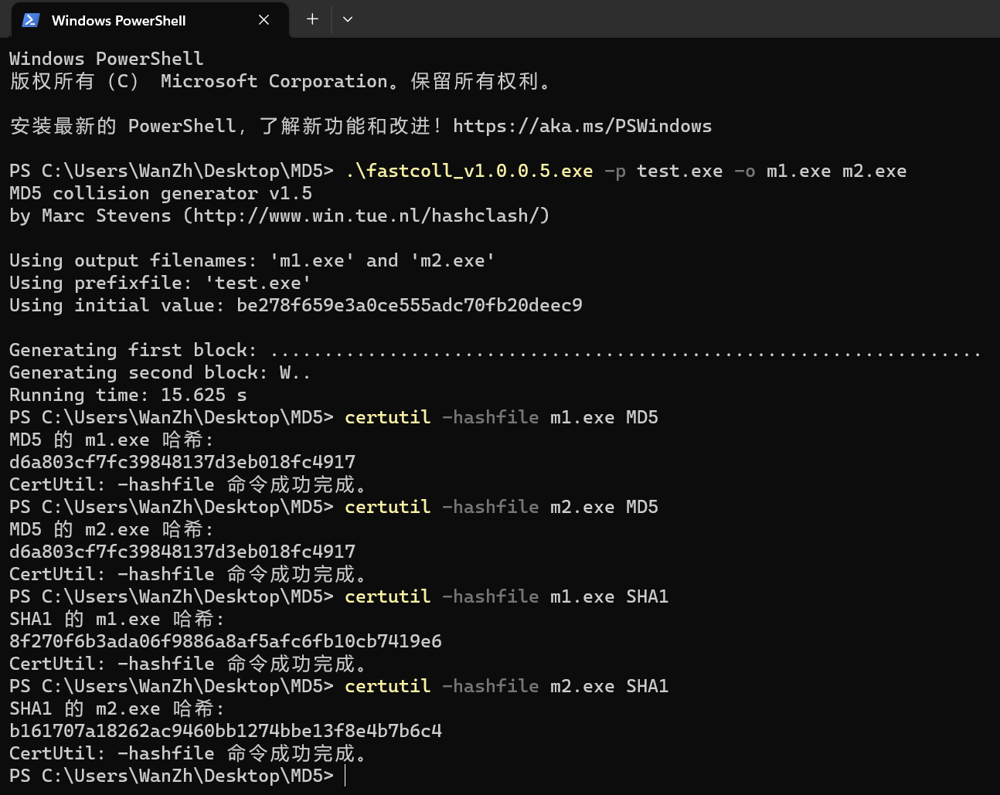

# 第4章 MD5散列值碰撞 实验报告 

万振南 2021030014

### 1.环境设置 

本实验的环境设置如下：

（1）一台装有 Window 11 操作系统的主机;

（2）fastcoll_v1.0.0.5 的可执行文件（文件下载地址http://www.thucsnet.com/wp-content/resources/fastcoll.zip）;

（3）可执行文件 test.exe，是由 Visual Studio 2022 生成的C++可执行文件。

fastcoll_v1.0.0.5 是 Windows 系统下的可执行程序,该程序针对 MD5 散列函数设计，可以快速制造散列值的碰撞，即对任一文件生成两个具有相同 MD5 散列值的文件。

### 2.关键步骤 

整个实验过程及步骤如下：

（1）打开 Windows 命令处理器，进入 fastcoll_v1.0.0.5.exe 所在的路径，利用命令 .\fastcoll_v1.0.0.5.exe -p test.exe -o m1.exe m2.exe 来针对某一可执行文件分别生成两个可执行文件，名称分别为 m1.exe m2.exe，如图所示。

（2）利用系统命令 certutil -hashfile file_path MD5 来查询两个文件 MD5 散列值，如图所示。

（3）利用系统命令 certutil -hashfile file_path SHA1 来查询两个文件的 SHA1 散列值，如图所示。

### 3.影响因素分析 

在本实验中，影响结果的关键因素有以下几个：

（1）fastcoll工具：使用的是fastcoll_v1.0.0.5工具，该工具专门用于生成具有相同MD5散列值的两个文件。该工具的算法和实现方式对实验结果产生直接影响。

（2）可执行文件：在实验中，选择了一个可执行文件（test.exe）作为蓝本，通过fastcoll工具生成了两个新的可执行文件（m1.exe和m2.exe）。可执行文件的内容和结构可能会影响到生成的文件的MD5散列值。

（3）操作系统环境：实验是在 Windows 11 操作系统下进行的。不同的操作系统版本和环境可能会对文件的散列值计算产生影响。

### 4.实验结果 

通过利用 fastcoll v1.0.0.5 工具，可以以一个可执行文件为蓝本生成两个新的可执行文件，这两个新生成的文件具有相同的 MD5 散列值。并且我们注意到，这两个文件的 SHA1 散列值是不同的。



### 5.关键源代码 

PS C:\Users\WanZh\Desktop\MD5>
```powershell
.\fastcoll_v1.0.0.5.exe -p test.exe -o m1.exe m2.exe
certutil -hashfile m1.exe MD5
certutil -hashfile m2.exe MD5
certutil -hashfile m1.exe SHA1
certutil -hashfile m2.exe SHA1
```

