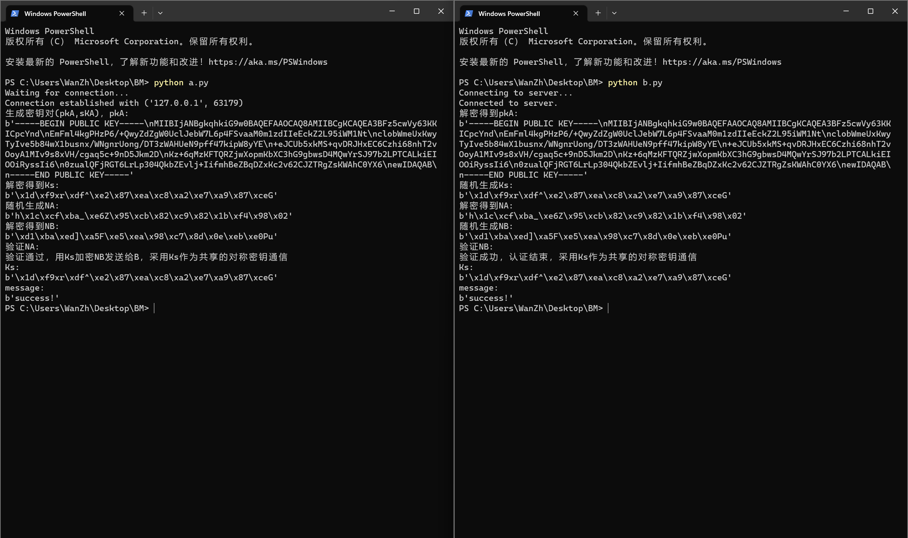

# 第4章 基于口令的身份验证协议 实验报告 

万振南 2021030014

### 1.环境设置 

本实验的环境设置如下：

操作系统：Window 11

编程语言：Python 3.11.1

密码学库：pycryptodome Version: 3.18.0

网络通信方式：TCP套接字（localhost作为服务器地址，因此可以在本地运行客户端和服务器端）

### 2.关键步骤 

整个实验过程及步骤如下：

（1）搭建实验环境，安装密码学库 `pip install pycryptodome`

（2）按照 Bellovin-Merritt 协议的交互流程图，撰写相应代码，具体过程如下：

第一步：

A、B共享秘密口令pw，
开始会话时A随机生成一对新的，用于公钥加密方案的公钥私钥对(pkA,skA)，
将用pw加密的pkA发送给B;

第二步：

B接收到该消息后，用pw解密得到pkA，
随机生成会话密钥Ks，把Ks用公钥pkA加密后的密文，再用pw对称加密后发送给A；

第三步：

A接收到第二条消息后先用pw解密，再用skA解密得到Ks，
并随机生成NA，用Ks作为密钥加密NA发送给NB；

第四步：

B接收到消息后解密得到NA，再随机生成NB，
连接NA和NB，用Ks加密后发送给A;

第五步：

A用Ks解密，验证第一个分量是否为NA，
如果不是，则验证不成功。如果是，则将得到的NB用Ks加密后发给B

第六步：

B验证收到的消息解密后是否为NB，
如果是，则验证成功确认对方是A。如果不是则验证不成功。会话结束。

（3）使用了TCP套接字进行通信，使用了两个进程模拟交互流程，并建立了安全信道，并对传输的信息进行了加密。

（4）使用 print 打印实验中的关键变量

（5）依次运行文件 a.py 和 b.py 观察实验结果

### 3.影响因素分析 

在本实验中，影响结果的关键因素有以下几个：

（1）网络环境：尽管本模拟实验是在本地进行的，但实际上应该是在网络上进行。Bellovin-Merritt协议是基于TCP套接字进行通信的，因此网络环境对实验的影响较大，网络延迟、丢包率等因素都可能影响通信的稳定性和效率。

（2）加密算法选择：实验中使用了AES和RSA加密算法，选择不同的加密算法可能会对实验产生影响。AES是对称加密算法，速度较快，适用于对大量数据进行加密；RSA是非对称加密算法，安全性较高，适用于密钥交换和数字签名等场景。选择合适的加密算法需要综合考虑安全性、性能和应用场景等因素。

（3）密钥管理：实验中涉及生成和传输密钥的过程，密钥的生成、存储和传输都需要保证安全性。密钥管理的不当可能导致密钥泄露或被篡改，从而影响通信的安全性。

（4）填充和去填充方式：在加密和解密过程中，使用填充和去填充方式是为了保证数据长度满足加密算法的要求。选择不合适的填充方式可能导致数据处理错误或安全漏洞。

（5）并发性和同步机制：实验中使用两个进程模拟交互流程，需要考虑并发性和同步机制的设计。合理的并发和同步机制可以保证通信的顺序和正确性。

（6）安全漏洞和攻击：Bellovin-Merritt协议的安全性也受到潜在的安全漏洞和攻击的影响。例如，密钥的泄露、中间人攻击、重放攻击等都可能破坏协议的安全性。因此，在设计和实现协议时需要考虑安全漏洞和防御措施。

### 4.实验结果 

如图所示，A端和B端通过TCP套接字进行通信，A端和B端的pkA，Ks，NA，NB均相同，最后成功建立了安全信道，采用Ks作为共享的对称密钥通信。

本实验完全实现了Bellovin-Merritt协议。



注：在Python中，前缀为b的字符串表示一个字节字符串（bytes string）。字节字符串是以字节（8位）为单位进行编码的字符串，而不是以字符为单位进行编码的。在字节字符串中，每个字符都用一个或多个字节表示。

### 5.关键源代码 

a.py
```python
import socket
from Crypto.Cipher import AES, PKCS1_OAEP
from Crypto.PublicKey import RSA
from Crypto.Random import get_random_bytes
from Crypto.Util.Padding import pad, unpad

# 生成AES密钥
def generate_aes_key():
    return get_random_bytes(16)  # 128位密钥

# AES加密
def aes_encrypt(key, data):
    cipher = AES.new(key, AES.MODE_CBC)
    ciphertext = cipher.encrypt(pad(data, AES.block_size))
    return cipher.iv + ciphertext

# AES解密
def aes_decrypt(key, data):
    iv = data[:AES.block_size]
    ciphertext = data[AES.block_size:]
    cipher = AES.new(key, AES.MODE_CBC, iv)
    plaintext = unpad(cipher.decrypt(ciphertext), AES.block_size)
    return plaintext

# RSA加密
def rsa_encrypt(public_key, data):
    cipher_rsa = PKCS1_OAEP.new(public_key)
    ciphertext = cipher_rsa.encrypt(data)
    return ciphertext

# RSA解密
def rsa_decrypt(private_key, data):
    cipher_rsa = PKCS1_OAEP.new(private_key)
    plaintext = cipher_rsa.decrypt(data)
    return plaintext

# 生成RSA密钥对
def generate_rsa_key_pair():
    key = RSA.generate(2048)
    private_key = key.export_key()
    public_key = key.publickey().export_key()
    return private_key, public_key

def main():
    # 创建TCP套接字
    sock = socket.socket(socket.AF_INET, socket.SOCK_STREAM)
    server_address = ('localhost', 12345)
    sock.bind(server_address)
    sock.listen(1)
    print("Waiting for connection...")

    # 等待客户端连接
    connection, client_address = sock.accept()
    print("Connection established with", client_address)

    try:
        # 第一步：A随机生成RSA密钥对并发送给B
        private_key, public_key = generate_rsa_key_pair()
        print("生成密钥对(pkA,sKA)，pkA:")
        print(public_key)

        connection.sendall(aes_encrypt(pw, public_key))

        # 第二步：接收B发送的加密的会话密钥Ks
        encrypted_ks = connection.recv(2048)
        ks = rsa_decrypt(RSA.import_key(private_key), aes_decrypt(pw, encrypted_ks))
        print("解密得到Ks:")
        print(ks)

        # 第三步：A生成NA，并将NA用Ks加密后发送给B
        na = get_random_bytes(16)
        print("随机生成NA:")
        print(na)
        encrypted_na = aes_encrypt(ks, na)
        connection.sendall(encrypted_na)
        
        # 第四步：接收B发送的加密的NA和NB，并验证NA是否正确
        encrypted_na_nb = connection.recv(2048)
        decrypted_na_nb = aes_decrypt(ks, encrypted_na_nb)
        received_na = decrypted_na_nb[:16]
        received_nb = decrypted_na_nb[16:]
        print("解密得到NB:")
        print(received_nb)
        print("验证NA:")
        if received_na == na:
            # 第五步：验证通过，A用Ks加密NB发送给B
            encrypted_nb = aes_encrypt(ks, received_nb)
            connection.sendall(encrypted_nb)
            print("验证通过，用Ks加密NB发送给B，采用Ks作为共享的对称密钥通信")
            print("Ks:")
            print(ks)
            message = b'success!'
            print("message:")
            print(message)
            encrypted_message = aes_encrypt(ks, message)
            connection.sendall(encrypted_message)

        else:
            print("验证失败，请重试...")

    finally:
        connection.close()
        sock.close()

if __name__ == '__main__':
    # 共享的秘密口令
    pw = b'mysecretpassword'
    main()

```

b.py
```python
import socket
from Crypto.Cipher import AES, PKCS1_OAEP
from Crypto.PublicKey import RSA
from Crypto.Random import get_random_bytes
from Crypto.Util.Padding import pad, unpad

# 生成AES密钥
def generate_aes_key():
    return get_random_bytes(16)  # 128位密钥

# AES加密
def aes_encrypt(key, data):
    cipher = AES.new(key, AES.MODE_CBC)
    ciphertext = cipher.encrypt(pad(data, AES.block_size))
    return cipher.iv + ciphertext

# AES解密
def aes_decrypt(key, data):
    iv = data[:AES.block_size]
    ciphertext = data[AES.block_size:]
    cipher = AES.new(key, AES.MODE_CBC, iv)
    plaintext = unpad(cipher.decrypt(ciphertext), AES.block_size)
    return plaintext

# RSA加密
def rsa_encrypt(public_key, data):
    cipher_rsa = PKCS1_OAEP.new(public_key)
    ciphertext = cipher_rsa.encrypt(data)
    return ciphertext

# RSA解密
def rsa_decrypt(private_key, data):
    cipher_rsa = PKCS1_OAEP.new(private_key)
    plaintext = cipher_rsa.decrypt(data)
    return plaintext

def main():
    # 创建TCP套接字
    sock = socket.socket(socket.AF_INET, socket.SOCK_STREAM)
    server_address = ('localhost', 12345)
    print("Connecting to server...")
    sock.connect(server_address)
    print("Connected to server.")

    try:
        # 第一步：接收A发送的加密的公钥pkA
        encrypted_public_key = sock.recv(2048)
        public_key = aes_decrypt(pw, encrypted_public_key)
        print("解密得到pkA:")
        print(public_key)

        # 第二步：B生成会话密钥Ks，并将Ks用A的公钥pkA加密后发送给A
        ks = generate_aes_key()
        print("随机生成Ks:")
        print(ks)
        encrypted_ks = aes_encrypt(pw, rsa_encrypt(RSA.import_key(public_key), ks))
        sock.sendall(encrypted_ks)

        # 第三步：接收A发送的加密的NA，并用Ks解密
        encrypted_na = sock.recv(2048)
        na = aes_decrypt(ks, encrypted_na)
        print("解密得到NA:")
        print(na)

        # 第四步：B生成NB，并将NA、NB用Ks加密后发送给A
        nb = get_random_bytes(16)
        print("随机生成NB:")
        print(nb)
        encrypted_na_nb = aes_encrypt(ks, na + nb)
        sock.sendall(encrypted_na_nb)

        # 第五步：接收A发送的加密的NB，并验证NB是否正确
        encrypted_nb = sock.recv(2048)
        decrypted_nb = aes_decrypt(ks, encrypted_nb)
        print("验证NB:")
        if decrypted_nb == nb:
            print("验证成功，认证结束，采用Ks作为共享的对称密钥通信")
            print("Ks:")
            print(ks)
            encrypted_message = sock.recv(2048)
            message = aes_decrypt(ks, encrypted_message)
            print("message:")
            print(message)

        else:
            print("验证失败，请重试...")

    finally:
        sock.close()

if __name__ == '__main__':
    # 共享的秘密口令
    pw = b'mysecretpassword'
    main()

```

PS C:\Users\WanZh\Desktop\BM>
```powershell
pip install pycryptodome
python a.py
python b.py
```

