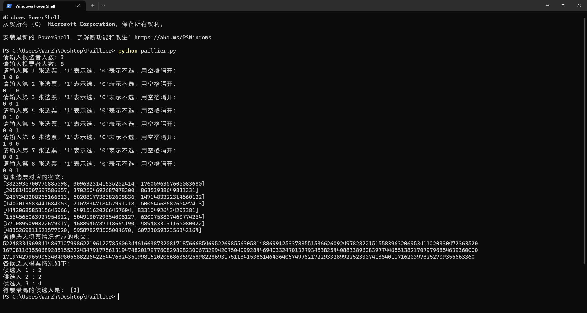

# 第5章 同态加密匿名投票 实验报告 

万振南 2021030014

### 1.环境设置 

本实验的环境设置如下：

操作系统：Window 11

编程语言：Python 3.11.1

### 2.关键步骤 

整个实验过程及步骤如下：

本实验主要是实现Paillier算法，实现该算法的步骤如下。

（1）密钥生成
首先，通过generate_key_pair()函数生成Paillier算法所需的公钥和私钥。在该函数中，首先生成两个大素数p和q，然后计算N = p * q和lambda_val = lcm(p - 1, q - 1)。接下来，随机选择一个数g，确保它是小于N^2的数，并且满足gcd(L(g, N), N) = 1。最后，返回生成的公钥(public_key)和私钥(private_key)。

（2）加密
对于每个选票，通过encrypt(public_key, m)函数进行加密。在该函数中，首先随机选择一个数r，并计算密文ciphertext = (g^m * r^N) % (N^2)，其中g是公钥中的随机数，m是选票的取值（1表示选，0表示不选）。

（3）解密
对于每个候选人的得票情况，通过decrypt(private_key, public_key, ciphertext)函数进行解密。在该函数中，首先计算分子numerator = L(ciphertext^lambda_val % (N^2), N)，分母denominator = L(g^lambda_val % (N^2), N)，然后计算明文plaintext = (numerator * inverse(denominator, N)) % N。其中，lambda_val是私钥，public_key包含了N和g。

（4）统计和输出结果
在主函数main()中，首先通过用户输入获取候选者人数n和投票者人数m。然后，创建一个m行n列的二维数组array，用于存储每张选票的取值。接下来，通过循环遍历输入的选票，将其加密并存储在array中。然后，初始化密文数组cipher和明文数组plain。通过循环遍历array，将每个候选人的密文相乘得到总密文cipher[i]，然后使用私钥对cipher[i]进行解密得到明文plain[i]。最后，输出每张选票对应的密文、各候选人得票情况对应的密文和各候选人得票情况。

### 3.影响因素分析 

在本实验中，影响结果的关键因素有以下几个：

（1）大素数生成：生成密钥对所需的大素数 p 和 q 的选择对算法的安全性有重要影响。生成的素数应满足一定的随机性和足够的位数，以防止被恶意破解。

（2）随机数选择：在加密和解密操作中，需要使用随机数 r 和随机选择的整数 g。这些随机数的选择应具有足够的随机性，以增加攻击者猜测私钥的难度。

（3）密钥保密性：生成的密钥对应该得到妥善保管，只有授权的机构才能够访问私钥。否则，私钥可能会被泄露，从而导致投票结果的安全性问题。

### 4.实验结果 

如图所示，在实验中，通过运行代码，可以得到以下实验结果：

（1）每张选票对应的密文：输出每张选票的密文表示，即加密后的选票情况。

（2）各候选人得票情况对应的密文：输出每个候选人得票情况的密文表示，即各候选人得到的加密票数。

（3）各候选人得票情况：输出每个候选人的得票情况，即解密后的明文表示。

（4）得票最高的候选人是：输出得票最高的候选人的编号。

这些实验结果均符合预期，说明本次实验实现了基于Paillier算法的匿名电子投票系统。



### 5.关键源代码 

paillier.py
```python
import random
import math


def generate_key_pair():
    # 生成密钥对
    p = generate_large_prime()
    q = generate_large_prime()
    N = p * q
    lambda_val = lcm(p - 1, q - 1)

    g = random.randint(1, N**2)  # 随机选择g
    while math.gcd(L(g, N), N) != 1:
        g = random.randint(1, N**2)

    public_key = (N, g)
    private_key = lambda_val

    return public_key, private_key


def encrypt(public_key, m):
    N, g = public_key
    r = random.randint(1, N)
    ciphertext = (pow(g, m, N**2) * pow(r, N, N**2)) % (N**2)
    return ciphertext


def decrypt(private_key, public_key, ciphertext):
    N, g = public_key
    lambda_val = private_key
    numerator = L(pow(ciphertext, lambda_val, N**2), N)
    denominator = L(pow(g, lambda_val, N**2), N)
    plaintext = (numerator * inverse(denominator, N)) % N
    return plaintext


def generate_large_prime():
    # 生成大素数
    while True:
        num = random.randint(2**15, 2**16)  # 生成15位随机数
        if is_prime(num):
            return num


def is_prime(n):
    # 判断是否为素数
    if n <= 1:
        return False
    if n <= 3:
        return True
    if n % 2 == 0 or n % 3 == 0:
        return False
    i = 5
    while i * i <= n:
        if n % i == 0 or n % (i + 2) == 0:
            return False
        i += 6
    return True


def lcm(a, b):
    # 计算最小公倍数
    return abs(a * b) // math.gcd(a, b)


def L(x, N):
    # L函数
    return (x - 1) // N


def inverse(a, N):
    # 计算a模N的逆元
    g, x, _ = extended_gcd(a, N)
    if g == 1:
        return x % N
    return None


def extended_gcd(a, b):
    # 扩展欧几里得算法
    if a == 0:
        return b, 0, 1
    g, x, y = extended_gcd(b % a, a)
    return g, y - (b // a) * x, x


def main():
    public_key, private_key = generate_key_pair()  # 密钥生成

    n = int(input("请输入候选者人数："))
    m = int(input("请输入投票者人数："))

    # 创建一个m行n列的二维数组
    array = []
    for i in range(m):
        row = []
        print("请输入第", i + 1, "张选票，'1'表示选，'0'表示不选，用空格隔开：")
        values = input().split()  # 将输入字符串拆分为多个部分
        row = list(map(int, values))  # 将每个部分转换为整数
        array.append(row)

    cipher = []
    plain = []
    for i in range(n):
        cipher.append(1)
        plain.append(1)

    for i in range(n):
        for j in range(m):
            array[j][i] = encrypt(public_key, array[j][i])

    print("每张选票对应的密文：")
    for i in range(m):
        print(array[i])

    for i in range(n):
        for j in range(m):
            cipher[i] = cipher[i] * array[j][i]
            plain[i] = decrypt(private_key, public_key, cipher[i])

    print("各候选人得票情况对应的密文：")
    for i in range(n):
        print(cipher[i])

    print("各候选人得票情况如下：")
    for i in range(n):
        print("候选人", i + 1, "：", end="")
        print(plain[i])

    max_value = max(plain)
    max_indices = [i + 1 for i, value in enumerate(plain) if value == max_value]
    print("得票最高的候选人是：", max_indices)

    
if __name__ == '__main__':
    main()

```

PS C:\Users\WanZh\Desktop\Paillier>
```powershell
python paillier.py
```